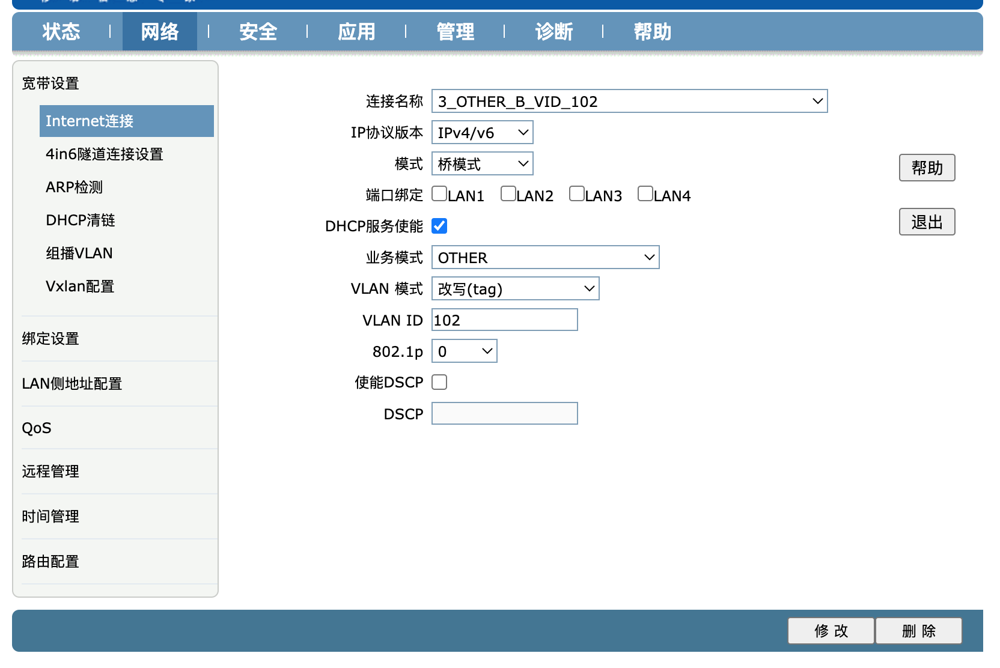

# 移动宽带单线复用(INTERNET+IPTV)

最近世界杯如火如荼，家里的IPTV因各种原因一直闲置，但是因世界杯的版权导致很多APP都无法畅快的看世界杯，于是想配置好IPTV看世界杯。首相想办法拿到了光猫的超级管理员账号（以前固定的账号密码时安装师傅还愿意提供，后来升级后每个光猫的密码不同，安装师傅也不搭理我了^-^），并通过配置VLAN的tag达到一条网线从光猫到路由器，路由器分别提供有线上网、无线上网和通过机顶盒观看IPTV电视（保证千兆带宽不削弱）。如果采用分线器的方式，会让原本千兆的网络只能使用百兆带宽，加两个分线器的成本也更高。

## 环境情况：

* 宽带：中国移动千兆

* 光猫：H2-3e(HWVer-E911)

* 电视：SONY(BRAVIA)

* 路由器：华硕AX86U  固件版本：梅林[386.7]

* 机顶盒：魔百盒 CM201-2  [设置默认密码：`10086`，网络及系统配置默认密码：`SCMCC10086`]

## 网络拓扑图：


## 步骤：

### 1. 获取光猫web管理员账号：

* 执行`telnet 192.168.1.1` , 账号：`CMCCAdmin`  默认密码：`aDm8H%MdA`
  
  

* 对配置文件进行解密，执行：
  
  ```
  cd /tmp
  sidbg 1 DB decry /userconfig/cfg/db_user_cfg.xml
  ```

* 执行`ls debug-decry-cfg`发现当前目录新增了一个文件

* 执行 `vi debug-decry-cfg` ,查找`DevAuthInfo`，找到`User`和`Pass`字段，其值即为超管账号密码
  
  

* 其他：如果想对光猫进行进一步操作，可能需要传输文件，但是光猫没有USB口，光猫自带`busybox`，可以执行`udpsvd -vE 0 8888 -c /tmp` (其中，`8888`为服务端口，`/tmp`为共享的路径)临时起一个TFTP服务，然后传输必要的文件。

### 2. 光猫配置：

* 浏览器打开光猫的管理WEB：`http://192.168.1.1/`，输入上面获取到的超管账号和密码登录；

* 点击 `网络-Internet连接`;

* 选择`INTERNET_B_VID_101`，端口绑定**取消**所有的选项，VLAN 模式选择`改写（tag）`, VLAN ID 填写`101`，点击`修改`保存；
  
  

* 选择`OTHER_B_VID_102`，端口绑定**取消**所有的选项，VLAN 模式选择`改写（tag）`, VLAN ID 填写`102`，点击`修改`保存；
  
  

* 点击`网络--绑定设置--绑定模式`，选择网线在光猫上接入的网口，点击`修改`，分别填入vlan绑定的映射，`101/101`，`102/102`，确认修改；
  
  

* 配置完成后建议重启光猫；

### 3. 路由器配置：

* 登录路由器的web管理；

* 点击`内部网络（LAN）--IPTV`，选择路由器接入网线的端口；

* 配置`VID`为`102`，点击`应用本页设置`，路由器将会重启，重启完成后即配置完成；
  
  

### 4. 电视配置：

由于采用单线复用之后，机顶盒启动的时间比一般情况要长，遥控器关掉电视屏幕的同时，机顶盒也会进入待机模式，等再次开机时，机顶盒又要重启，很不方便。可以通过关闭机顶盒的`HDMI CEC待机` 达到效果，但是这样设置之后，发现电视机的遥控机不能操作机顶盒了。于是考虑通过在电视上配置，使得关电视时不影响机顶盒待机（机顶盒的功耗可以忽略不计）。步骤如下：

* 点击`设置--观看电视--外部输入--BRAVIA Sync设定`，关闭`设备自动关机`即可；

* 如果不需要连接机顶盒就自动打开电视，还可以关闭`电视机自动开机`；

* 接下来我们就可以用电视遥控器控制电视和机顶盒，一切都OK啦；
